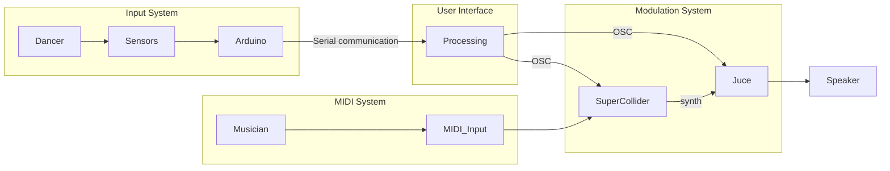
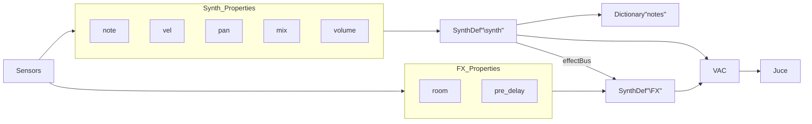

# Jacob SuperCollier -  COLM Dance Designer

"COLM Dance Designer" is a computer music system that allows a dancer to interact with the sound desgin of a MIDI keyboard.
Through various sensors, the dancer movements can determine how the sound processing elements will behave in real-time.

You may find a demonstration video in the repository.

## What do you need?

In order to use this system at the best of its potential, you need :
* a MIDI instrument
* an external electronic platform (such as Arduino) and some sensors
* a PC and all you need to connect them all

## Software components

This system consists of:

 * a sound synthesis module made in SuperCollider

* a sound effects module made in JUCE
* an external board management module (Arduino IDE) 
* a GUI module made in Processing 

## Libraries, modules and external dependencies

The SuperCollider code works without any external dependency.

The plugin development has been done by using the JUCE's audio plugin library, in addition to the `juce_dsp` module and the `juce_osc` module.

The Arduino snippet requires two libraries in order to work :

* the `Arduino-MMA7361` library, which offers specific functionalities for the Triple Axis Accelerometer (by DFRobot), that we found on GitHub (see the report for more details) 
* the built-in `Serial communication` library, in order to send messages that will be read by Processing
* `Arduino AVR Board` and `Arduino megaAVR Board` which allow to use WI-Fi Rev2 board

The Processing code requires the `oscP5` and the `netP5` libraries in order to setup the OSC communication.
Its graphic interface has been developed through the `G4P` library, that also needs to be downloaded (both Tool and Library).

A virtual audio cable is necessary to connect SuperCollider and the standalone plugin.
In this system, the `Hi-Fi Cable` by VB-Audio has been used and it needs to be installed and setup accordingly to your PC.
The user must carefully set the same sampling rate for both the plugin and the virtual cable, in addition to try setting the lowest latency possible.

Consult the report for more details.

## Setting everything up

Finally, in order to use every components in this repository, you need to follow these steps in the given order:

* open the Arduino script and upload it on the board
* check that the serial monitor is receiving values correctly
* close the serial monitor display
* open the sketch code in Processing and run it
* check that you can see the GUI, and that the OSC messages are sent, you can check the Processing's console
* open the SuperCollider script, boot the server and run every block
* (Optional) open the backing track code, that offers you a 1-minute track to play along with
* open the standalone plugin and setup "Hi-Fi Cable Output" as input source

## Project's limitations

As of now, the JUCE code correctly receives the Processing's OSC messages but no modifications occur in the plugin's GUI, only SuperCollider is effectively responsive to the dancer.
Moreover, the accelerometer we used for this project is actually closer to a gyroscope.
The dancer's movements are not interpreted as we'd like them to be.
Indeed, the sensor's inclination is the prevalent modifier.

The heart rate we used also seems to read BPM values lower than 75.
Indeed, after several trials, the detected value never exceeded 75 BPM even when the dancer was cardiacally stressed.

## Future improvements

As said before, the sensors are the first thing we'd like to fix.
Acquiring better sensors might solve a lot of the issues we faced.
In alternative, the sensors behaviour can be kept and only change how the measured values influence the signal processing.

Besides, the JUCE script also needs to modify the modulations' parameters as given in the OSC messages.
A way to fix this problem may consist in using `juce::Value`, `.referTo()` and `.getValueObject()`.
On the other hand, supposing the problematic was given by the conflict between incoming OSC messages and the continuous reading (by the `AudioProcessorValueTreeState`) of the sliders, an attempt including an `AudioProcessorValueTreeState::Listener` was made.
However we could not manage to fix it before the deadline.

Moreover, it would be interesting to find a better packaging for the Arduino board and its sensors to reduce the discomfort of the actual setup.
An approach might consist in setting up the Wi-Fi communication, in order to get rid of the cables. 

## Credits

This computer system is the result of the project work for "Computer Music - Languages and Systems" exam at Politecnico di Milano, made by "Jacob SuperCollier" team.

"Jacob SuperCollier" is:

* Cagnetta Angelica
* Di Lorenzo Giuliano
* Mugnaini Nicola
* Ouali Ernest

We thanks Sgualdino Serena for the dancing performance contribution in the video demo.
